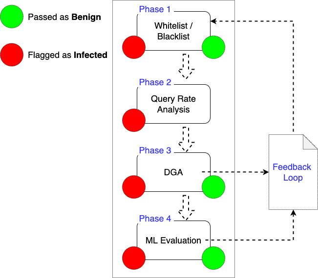
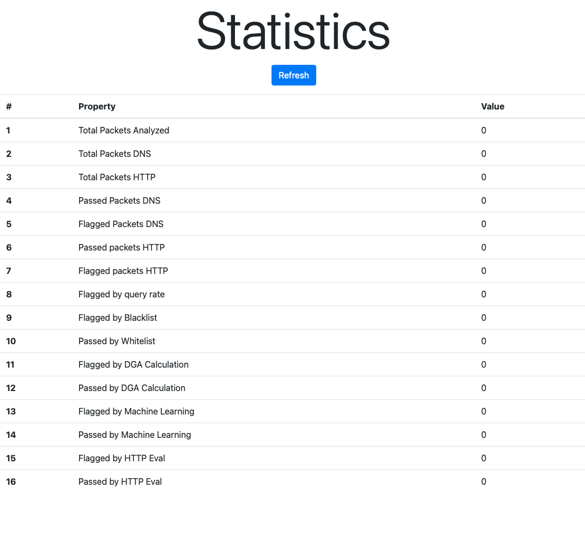

# Mondeo - Multistage Botnet Detection

## Table of Contents
- [Mondeo - Multistage Botnet Detection](#mondeo---multistage-botnet-detection)
  - [Table of Contents](#table-of-contents)
  - [Introduction](#introduction)
  - [Disclaimer](#disclaimer)
  - [Installation](#installation)
    - [Dependencies](#dependencies)
  - [Documentation](#documentation)
    - [DNS Traffic Analysis](#dns-traffic-analysis)
      - [Pipeline-Analysis](#pipeline-analysis)
        - [Blacklist/Whitelist Analysis;](#blacklistwhitelist-analysis)
          - [Feedback system](#feedback-system)
      - [Query Rate Analysis](#query-rate-analysis)
      - [DGA probability Analysis](#dga-probability-analysis)
      - [ML Evaluation](#ml-evaluation)
    - [HTTP Traffic Analysis](#http-traffic-analysis)
      - [Pipeline Analysis](#pipeline-analysis-1)
    - [WebUI](#webui)
      - [Main Menu](#main-menu)
      - [filelist](#filelist)
      - [check_stats](#check_stats)
      - [Upload](#upload)
    - [Endpoints](#endpoints)
      - [save_stats](#save_stats)
        - [Method : GET](#method--get)
        - [Description](#description)
        - [Response](#response)
          - [Success](#success)
          - [Failure](#failure)
      - [stats_time](#stats_time)
        - [Method : GET](#method--get-1)
          - [Return](#return)
      - [stats_eval](#stats_eval)
        - [Method : GET](#method--get-2)
          - [Return](#return-1)
      - [stats_domain](#stats_domain)
        - [Method : GET](#method--get-3)
          - [Return](#return-2)
      - [all_stats](#all_stats)
        - [Method : GET](#method--get-4)
          - [Return](#return-3)
      - [analyze_dns](#analyze_dns)
        - [Method : POST](#method--post)
        - [Input (JSON format)](#input-json-format)
          - [Example](#example)
        - [Response](#response-1)
          - [Success](#success-1)
          - [Example](#example-1)
          - [Failure](#failure-1)
          - [Example](#example-2)
      - [analyze_http](#analyze_http)
        - [Methods : POST](#methods--post)
        - [Input (JSON format)](#input-json-format-1)
        - [Example](#example-3)
        - [Response](#response-2)
          - [Success](#success-2)
          - [Example](#example-4)
          - [Failure](#failure-2)
          - [Example](#example-5)
  - [Papers (Will be updated accordingly)](#papers-will-be-updated-accordingly)
## Introduction
The number of mobile devices is increasing exponentially, allowing users to access services through dedicated applications. This mass adoption also has associated security threats, that can impact overall systems in the internet, as devices can act in a coordinated fashion, as part of distributed denial of service attacks, through botnets. FluBot is one of the most recent threats in terms of malware that uses DNS protocol to interact with Command and Control (C2) serversm having an impact on the end device as well as on operator networks. In this paper, we propose MONDEO, a multistage mechanism with a flexible pipeline for the detection of FluBot and other C2-based malware that rely on DNS. MONDEO has the advantage of not requiring any deployment of software, agents or configuration in mobile devices, allowing network operators to collect and process data efficiently whilst integrating with core Internet service platforms like DNS. MONDEO contains diverse pipeline phases, tailored for detecting specific botnet patterns such as DGA, query ratio or even suspicious domain names. It is also able to process the stream of packets with high efficiency, providing a classification as the final result(infected or not). The evaluation results demonstrates the suitability of MONDEO to be deployed in network infrastructures of operators with minimal overhead and accurate precision levels 

## Disclaimer
This application present a proof of concept for detecting botnet activity in networks. It should **NOT** be used in a real environment, from both a security and scalability point of view. Furthermore it is presented as is, under the context of the GPL2.0 license (check the license file).

## Installation
MONDEO runs in a Docker container in order to establish both ease of install and ease of use.
First you must install docker in your system. Please refer to the [docker installation page](https://docs.docker.com/get-docker/).
After installing docker, the installation follows the a regular docker container install.

```
docker-compose -f docker-compose.yml up --build
```
### Dependencies 
Python version : 3.9
```bash
Flask==2.2.2
Jinja2==3.1.2
tld==0.12.6
tensorflow
tensorflow-io
matplotlib==3.5.2
numpy==1.21.5
pandas==1.4.2
dgaintel==2.3
scikit-learn==1.1.3
```

## Documentation

At core of this application lay two main functions:
* Analysing DNS Traffic;
* Analysing HTTP Traffic;

### DNS Traffic Analysis
The analysis of this traffic enables the detection of infected devices. For this to work, the packets in consideration should be respect the parameters:
* Be DNS;
* Be a query packet;

From this packet we extract several features:
* Source Host;
* Destination;
* Frame length;
* DNS Flags;
* DNS count queries;
* DNS Query Type;
* DNS Query Name;
* Timestamp;

They will be later used in different stages of the pipeline

#### Pipeline-Analysis
Note: This is an abridged version of explaining how the pipeline works, for a comphreensive description please consult the paper (Check References).

The pipeline contains 4 core steps, aimed to remove packets from the pipeline as early as possible, this ensures efficiency and further scalability of the pipeline. They are listed below:

* Blacklist/Whitelist analysis;
* Query rate analysis;
* DGA probability analysis;
* ML Evaluation;


Note: The steps were decided after an extensive analysis of the behaviour of the malware.

##### Blacklist/Whitelist Analysis;
As simple as the name implies. The idea here is to allow for platform adopter to curate their own lists, tailored for their needs. A whitelist will automatically allow packets into the network, while a blacklist will automatically disallow packets from the network.

###### Feedback system
Using this mechanism it is possible to feed both lists using evaluation from other steps, though it is not recommended to automatically feed a whitelist. As if there is a problem with the blacklist, a simple customer call will suffice. On the other hand, if malware manages to get whitelisted, it will be forever under the radar.

#### Query Rate Analysis
A common behaviour that this malware seems to use and abuse, is the amount of DNS queries made. This is mainly due to the properties of DGA algorithms (explained below). It is not relevant for this step which domains are being queried, but the amount of times they are. A regular "human" user will no generate dozens of queries per second, amount to thousands in a few minutes. This indicates the behaviour of a bot, which we aim to catch. To prevent to many false positives, 2 metric are configurable:
* The number of packets before a warning is fired out;
* The smallest $ time \Delta$  before a packet is considered to be out of the norm.

#### DGA probability Analysis
Follow this behaviour pattern of high query rate, we reacht he conclusion that the malware is using a DGA algorithm. This algorithm generates, random but deterministic domains, which, since they are deterministic, can be registered or deleted fast, to prevent the botnet to go down. To detected if a domain is DGA-generated an python package was used [dga intel](https://github.com/sudo-rushil/dgaintel), whch produces a floating point evaluation (0..1) corresponding to the certainty of the evaluation.

#### ML Evaluation
The final steps aims to evaluate the hardest of packets. According to our evalution less than 1% of the packets should reach this stage. Here a machine learning algorithm uses the properties of the packet to evaluate if it think wheter is it infected or not.

### HTTP Traffic Analysis
The second core function available is the http analysis. This analysis, paired with the DNS analysis, enables the discovery of the botnet comand and control-server.

At its core, this analysis is much simpler than the DNS analysis. Here we focus on packets that respect the following criteria
* Be HTTP;
* Target port 80;
* Request Methods to be POST.

From this packet we extract several features:
* Source Host;
* Destination;
* Domain;
* Timestamp;

#### Pipeline Analysis
There are 3 core assertions that must be made before to confirm whether a IP is a possible C2 server:
* The destination (devices), must be in the infected list (which he enter by having any DNS query previously flagged);
* The query must be within a $time \Delta$ (defined in config);
* The query URI must be considered dga generated (dga evaluation must surpass the default config value).

If all conditions are met the IP is considered to the infected. Otherwise, the response is negative.

### WebUI
#### Main Menu
Main page for the application, functions available:
* Access the Download Page - Access the download Page
* Check Current Stats - Loads the statistics page
* Reset - resets the current statistics
* Save - saves the current statistics
* Upload a File - Loads the upload file page

#### filelist
Lists all files available for download (from the webUI)

#### check_stats
Presents an abridged version of the available statistics


#### Upload 
Uploads a file into the system, this file will be used to reset and load stats. File must be compliant with the system (for example, downloaded from Download Page).


### Endpoints 
#### save_stats
##### Method : GET
##### Description
Saves the stats into a file
##### Response
###### Success
```json
{
 "code": "200",
 "success": True, 
 "filename": filename
 }
```
###### Failure
```json
{
 "code": "500",
 "success": False, 
 "filename": None
 }
```
#### stats_time
##### Method : GET
Retrieves the time stats in json format
###### Return
```json
{
    "time_flagged_by_blacklist": {
        "average": NaN,
        "std": NaN,
        "total": 0
    },
    "time_flagged_by_dga_prob": {
        "average": NaN,
        "std": NaN,
        "total": 0
    },
    "time_flagged_by_eval_http": {
        "average": NaN,
        "std": NaN,
        "total": 0
    },
    "time_flagged_by_ml": {
        "average": NaN,
        "std": NaN,
        "total": 0
    },
    "time_flagged_by_query_rate": {
        "average": NaN,
        "std": NaN,
        "total": 0
    },
    "time_of_flagged_packets_dns": 0.0,
    "time_of_flagged_packets_http": 0.0,
    "time_of_passed_packets_dns": 0.0,
    "time_of_passed_packets_http": 0.0,
    "time_passed_by_dga_prob": {
        "average": NaN,
        "std": NaN,
        "total": 0
    },
    "time_passed_by_eval_http": {
        "average": NaN,
        "std": NaN,
        "total": 0
    },
    "time_passed_by_ml": {
        "average": NaN,
        "std": NaN,
        "total": 0
    },
    "time_passed_by_whitelist": {
        "average": NaN,
        "std": NaN,
        "total": 0
    },
    "total_time_packets": 0.0,
    "total_time_packets_dns": 0.0,
    "total_time_packets_http": 0.0
}
```

#### stats_eval
##### Method : GET
Retrieves the evaluation stats in json format
###### Return
```json
{
    "flagged_by_blacklist": 0,
    "flagged_by_dga_calc": 0,
    "flagged_by_http_eval": 0,
    "flagged_by_ml": 0,
    "flagged_by_query_rate": 0,
    "flagged_packets_dns": 0,
    "flagged_packets_http": 0,
    "passed_by_dga_calc": 0,
    "passed_by_http_eval": 0,
    "passed_by_ml": 0,
    "passed_by_whitelist": 0,
    "passed_packets_dns": 0,
    "passed_packets_http": 0,
    "total_packets": 0,
    "total_packets_dns": 0,
    "total_packets_http": 0
}
```


#### stats_domain
##### Method : GET
Retrieves the domain stats in json format
###### Return
```json
{
    "ai_flagged_domains": [],
    "ai_passed_domains": [],
    "blacklist_domains": [],
    "dga_flagged_domains": [],
    "dga_passed_domains": [],
    "http_flagged_domains": [],
    "http_passed_domains": [],
    "query_rate_domains": [],
    "whitelist_domains": []
}
```
#### all_stats
##### Method : GET
Retrieves all stats (eval + domain + time) in json format. **WARNING** : May result in a large response
###### Return
```json
{
    "ai_flagged_domains": [],
    "ai_passed_domains": [],
    "blacklist_domains": [],
    "dga_flagged_domains": [],
    "dga_passed_domains": [],
    "flagged_by_blacklist": 0,
    "flagged_by_dga_calc": 0,
    "flagged_by_http_eval": 0,
    "flagged_by_ml": 0,
    "flagged_by_query_rate": 0,
    "flagged_packets_dns": 0,
    "flagged_packets_http": 0,
    "http_flagged_domains": [],
    "http_passed_domains": [],
    "passed_by_dga_calc": 0,
    "passed_by_http_eval": 0,
    "passed_by_ml": 0,
    "passed_by_whitelist": 0,
    "passed_packets_dns": 0,
    "passed_packets_http": 0,
    "query_rate_domains": [],
    "time_flagged_by_blacklist": {
        "average": NaN,
        "std": NaN,
        "total": 0
    },
    "time_flagged_by_dga_prob": {
        "average": NaN,
        "std": NaN,
        "total": 0
    },
    "time_flagged_by_eval_http": {
        "average": NaN,
        "std": NaN,
        "total": 0
    },
    "time_flagged_by_ml": {
        "average": NaN,
        "std": NaN,
        "total": 0
    },
    "time_flagged_by_query_rate": {
        "average": NaN,
        "std": NaN,
        "total": 0
    },
    "time_of_flagged_packets_dns": 0.0,
    "time_of_flagged_packets_http": 0.0,
    "time_of_passed_packets_dns": 0.0,
    "time_of_passed_packets_http": 0.0,
    "time_passed_by_dga_prob": {
        "average": NaN,
        "std": NaN,
        "total": 0
    },
    "time_passed_by_eval_http": {
        "average": NaN,
        "std": NaN,
        "total": 0
    },
    "time_passed_by_ml": {
        "average": NaN,
        "std": NaN,
        "total": 0
    },
    "time_passed_by_whitelist": {
        "average": NaN,
        "std": NaN,
        "total": 0
    },
    "total_packets": 0,
    "total_packets_dns": 0,
    "total_packets_http": 0,
    "total_time_packets": 0.0,
    "total_time_packets_dns": 0.0,
    "total_time_packets_http": 0.0,
    "whitelist_domains": []
}
```

#### analyze_dns
##### Method : POST
##### Input (JSON format)
* source - int (ipv4 to int conversion)
* destination - int (ipv4 to int conversion)
* length - int
* nr_of_requests - int
* question_type - int
* queries_null - int
* timestamp - int
* domain - str
###### Example
```json
  {
    "source": 39028245,
    "destination": 3247033209,
    "length": 78,
    "dns_flag": 0,
    "nr_of_requests": 1,
    "question_type": 28,
    "queries_null": 0,
    "timestamp": 1657704769,
    "domain": "octocloud.net"
}
```
##### Response
###### Success
* code - int
* prediction - str
* domain - str
* source - str
###### Example
```json
{
    "code": 200,
    "domain": "octocloud.net",
    "prediction": "0.85",
    "source": "39028245"
}
```

###### Failure
* code - int
* error_msg - str

###### Example
```json
{
    "code": 400,
    "message": "Bad format for http request (check Documentation)"
}
```
#### analyze_http 
##### Methods : POST
##### Input (JSON format)
* source - int (ipv4 to int conversion)
* destination - int (ipv4 to int conversion)
* timestamp - int
* domain - str

##### Example
```json
{
    "source": 39028245,
    "destination": 3247033209,
    "timestamp": 1657704769,
    "domain": "octocloud.net" 
}
```
##### Response
###### Success
* code - int
* prediction - str
* domain - str
* source - str

###### Example
```json
{
    "code": 200,
    "domain": "octocloud.net",
    "prediction": "0",
    "source": "3247033209"
}
```

###### Failure
* code - int
* error_msg - str

###### Example
```json
{
    "code": 400,
    "message": "Bad format for http request (check Documentation)"
}
```


## Papers (Will be updated accordingly)

* Paper 1 - To be published
* Paper 2 - To be published